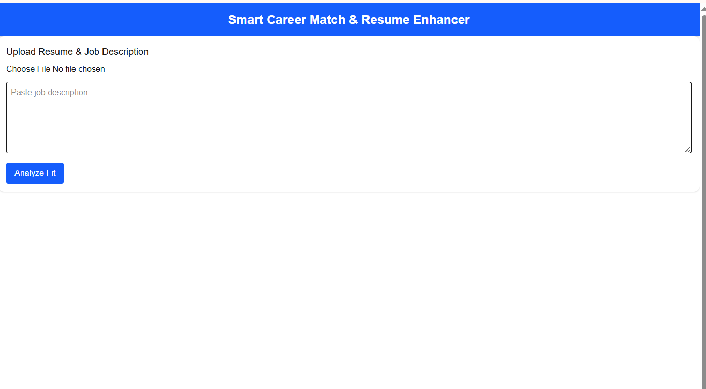
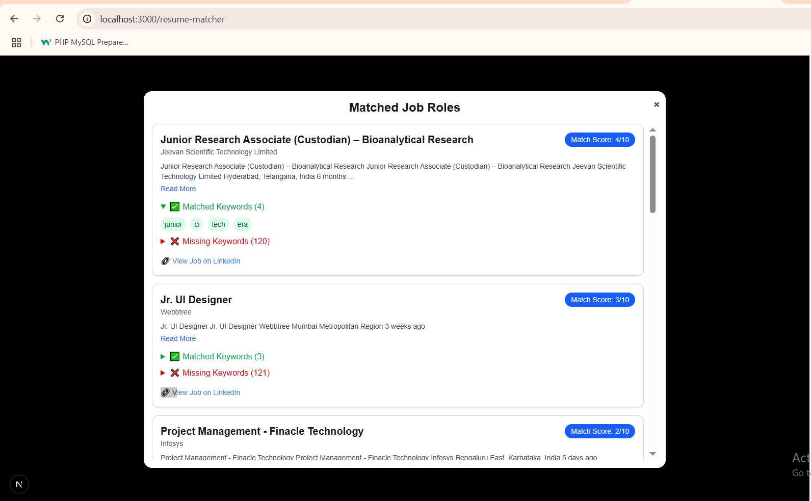
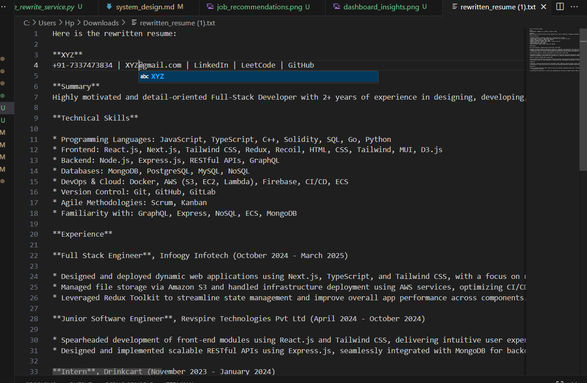
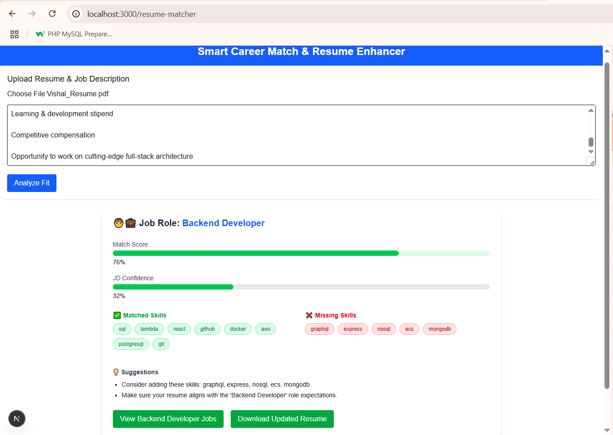

# 🧠 AI-Powered Resume Matcher & Recommendation System

An intelligent full-stack platform that helps users:
- ✅ Match their resume to a job description (JD)
- ✅ Identify matched/missing skills and roles
- ✅ Receive real-time job recommendations
- ✅ Download an AI-enhanced rewritten resume

---

## 🖼️ UI Snapshots

| Upload Resume View | Job Recommendations | Rewritten Resume |
| ------------------ | ------------------- | ---------------- |
|  |  |  | 

---

## ✨ Features

- 🔍 **Resume-JD Matching**: Calculates fit score, matched & missing skills, confidence level, and role prediction.
- 🤖 **AI Resume Rewriting**: Generates a tailored version of your resume aligned with the JD.
- 💼 **Job Recommendations**: Scrapes real-time job listings based on your skills and experience.
- ⚡ **Semantic Search**: Uses FAISS and sentence embeddings for fast, meaningful comparisons.
- 📦 **Clean UI**: Modern React frontend with Tailwind CSS for an intuitive user experience.

---

## 📐 System Design (High-Level Architecture)

text
+-------------------+       /upload-resume        +---------------------+
|  React Frontend   | ─────────────────────────▶ | FastAPI Backend     |
|                   |                            | /ai/analyze         |
+-------------------+                            +----------+----------+
                                                             |
                                                             ▼
                                                  +-----------------------+
                                                  | Resume Parsing Engine |
                                                  +----------+------------+
                                                             |
                                                             ▼
                                          +----------------------------------+
                                          | Sentence Embeddings (MiniLM-L6) |
                                          | + Redis Cache                   |
                                          +----------+-----------------------+
                                                     |
                                                     ▼
                                      +------------------------------------------+
                                      | Resume Match Engine (FAISS Semantic L2) |
                                      +----------------+-------------------------+
                                                       |
                                                       ▼
                                ┌────────────────────────────────────────────────────┐
                                │                Match Result JSON                    │
                                └────────────────────────────────────────────────────┘
                                                       |
                                                       ▼
                                       +-------------------------------+
                                       | resumeController → Frontend  |
                                       +-------------------------------+

## 🔁 Feature Flow Breakdown
### 1️⃣ Resume Upload & Matching
#### Frontend: Upload PDF/DOCX + JD text

#### Backend:

Extract text

Embed via MiniLM-L6-v2

Match using FAISS (Flat L2)

Cache embeddings in Redis

Return JSON: fit_score, matched/missing skills, confidence, etc.

### 2️⃣ Real-Time Job Recommendations
Input: resume_keywords[] + experience_years

Backend Flow:

Scrape jobs (via Puppeteer or SerpAPI)

Score via keyword overlap and experience filters

Recommend top 5 jobs

### 3️⃣ Resume Rewriting
Input: Resume Text + JD Text + Missing Fields

Backend Flow:

Use OpenAI/Groq API

Generate AI-enhanced resume

Return updated text (auto-download)

### 📦 Sample Match Response

export interface MatchResult {
  jd_confidence: number;
  fit_score: number;
  job_keywords: string[];
  resume_keywords: string[];
  matched_skills: string[];
  missing_skills: string[];
  jd_role_prediction: string;
  recommendations: string[];
  experience_years: number;
  parsed_resume_text: string;
  parsed_jd_text: string;
}

--------

## 🧠 AI / NLP Modules

| Module                     | Description                      | Tech Used                 |
| -------------------------- | -------------------------------- | ------------------------- |
| `embedding.py`             | Sentence embeddings (MiniLM)     | `all-MiniLM-L6-v2`, Redis |
| `resume_match_engine.py`   | JD ↔ Resume semantic comparison  | FAISS Flat L2             |
| `rewrite_resume_engine.py` | Resume enhancement with AI       | OpenAI GPT (via Groq API) |
| `job_scraper.py`           | Scrape job listings in real-time | Puppeteer or SerpAPI      |

------

## 🌐 API Endpoints

| Route                  | Method | Description                            |
| ---------------------- | ------ | -------------------------------------- |
| `/upload-resume`       | POST   | Upload resume & JD → get match results |
| `/job-recommendations` | POST   | Get personalized job recommendations   |
| `/rewrite-resume`      | POST   | Get AI-enhanced resume version         |
| `/health`              | POST   | Server health check                    |

----

## 💻 Frontend Features
File Uploads: Resume (PDF/DOCX) + JD text

### Visual Insights:

Fit Score (Progress Bar)

Matched/Missing Skills (Badges)

AI Resume Output: Auto-download as .txt or .json

Job Modal: Top 5 matching job listings in a modal

Built using Next.JS + Tailwind CSS

----

## 🔐 Tech Stack

| Layer       | Tech Used                  |
| ----------- | -------------------------- |
| Frontend    | NextJS, Tailwind CSS        |
| Backend     | FastAPI                    |
| NLP         | Sentence Transformers, GPT |
| Semantic DB | FAISS (Flat L2)            |
| Caching     | Redis                      |
| Scraping    | Puppeteer / SerpAPI        |
| Cloud/API   | Groq + OpenAI Chat API     |

----

## 🚀 Getting Started

### ✅ Prerequisites
Python 3.10+

Node.js 18+

### 🔧 Backend Setup
cd backend
python -m venv venv
source venv/bin/activate  # or venv\Scripts\activate
pip install -r requirements.txt
uvicorn main:app --reload

### 💻 Frontend Setup
cd frontend
npm install
npm run dev

----

## 📚 Blog & Demo

### 📖 Blog Post → (https://medium.com/@muskankushwah85/from-full-stack-developer-to-ai-ml-engineer-my-first-intelligent-resume-matching-system-a0f5077456e8)

### 🎥 YouTube Demo → Coming Soon

-----

## 📄 License
MIT License – © 2025 MuskanKushwah

## 🤝 Contributions
Contributions, ideas, and feedback are always welcome! Feel free to open issues or pull requests.